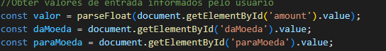

# conversor de moeda

este projeto consiste em ser um conversor de moedas, de ínicio temos as seguintes converssões
para Dolar(USD), Euro(EUR) e Real(BRL), mais também pode ser adicionado futuramente uma atuaçização de outras moedas e criar uma maior diversidade. o usuário pode inserir valor que ele desejar para converter, ele seleciona para que tipo de moeda ele deseja converter e em seguida o programa retorna o valor convertido.

## Funcionalidades:

- **Entrada de Valor**: Os usuários podem inserir um valor numérico que desejam converter.
- **Seleção de Moedas**: O conversor suporta três moedas: Dólar (USD), Euro (EUR) e Real (BRL).
- **Conversão**: Após inserir o valor e selecionar as moedas, o usuário pode clicar em "Converter" para ver o resultado da conversão.
- **Limpar Formulário**: Um botão "Limpar" para resetar os campos de entrada.

## Como Usar:

1. **Clone o repositório** ou faça o download dos arquivos.
2. **Abra o arquivo `index.html`** em um navegador web.
3. **Insira o valor** que deseja converter.
4. **Selecione a moeda de origem** e a moeda de destino.
5. Clique em **"Converter"** para ver o resultado.
6. Use o botão **"Limpar"** para resetar os campos.

## Explicação do código em JavaScript:

1) Capturar o evento do envio do Formulário:

* getElementById('currency-form'): Seleciona o formulário pelo ID currency-form.
* addEventListener('submit', ...): Adiciona um ouvinte de eventos para o evento de submissão do formulário.
* event.preventDefault(): Impede o comportamento padrão de submissão do formulário, que recarregaria a página.

2) Obtenção de valores:

* valor: Obtém o valor inserido pelo usuário e o converte para um número de ponto flutuante.
* daMoeda: Obtém a moeda de origem selecionada pelo usuário.
* paraMoeda: Obtém a moeda de destino selecionada pelo usuário.

3) Definição das Taxas de Câmbio:

## Tecnologias Utilizadas

- HTML
- CSS
- JavaScript

